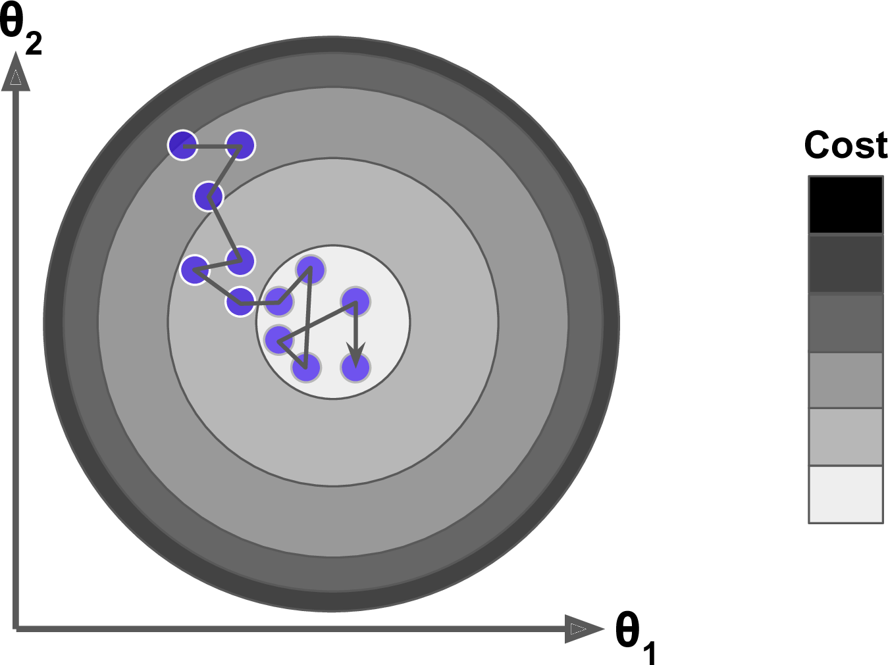
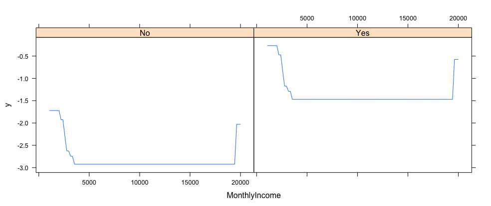

```{r setup, include = FALSE}
knitr::opts_chunk$set(
  collapse = TRUE,
  message = FALSE,
  warning = FALSE,
  fig.align = "center",
  fig.path = "figures/"
)
```


Gradient boosted machines (GBMs) are an extremely popular machine learning algorithm that have proven successful across many domains and is one of the leading methods for winning Kaggle competitions. Whereas random forests build an ensemble of deep independent trees, GBMs build an ensemble of shallow and weak successive trees with each tree learning and improving on the previous. When combined, these many weak successive trees produce a powerful “committee” that are often hard to beat with other algorithms. This vignette is intended to cover the fundamentals of GBMs and get you up and running with `gbm` as quickly as possible.  For a more detailed background on the algorithmic variations and implementations of GBM see `vignette("algorithm-implementation", package = "gbm")`.


## tl;dr

This vignette serves as an introduction to GBMs, implementation with the `gbm` package, and covers the following material:

* [Replication requirements](#req): What you’ll need to reproduce the analysis in this tutorial.
* [The idea](#gbm-idea): A quick overview of how GBMs work.
* [Regression implementation](#regress): using `gmb` for a regression problem.
* [Binomial classification implementation](#binary): using `gmb` for a binary classification problem.
* [Multinomial classification implementation](#multinomial): using `gmb` for a multinomial classification problem.
* [Learn more](#learn-more): resources to help you learn more.


## Replication requirements {#req}

This vignette focuses on the `gbm` package but also leverages additional packages for complimentary features.

```{r pkg-req}
library(gbm)
library(rsample)
```


## The Idea {#gbm-idea}

Several supervised machine learning models are founded on a single predictive model (i.e. linear regression, penalized models, naive Bayes, support vector machines). Alternatively, other approaches such as bagging and random forests are built on the idea of building an ensemble of models where each individual model predicts the outcome and then the ensemble simply averages the predicted values.  The family of _boosting methods_ is based on a different, constructive strategy of ensemble formation. 

The main idea of boosting is to add new models to the ensemble ___sequentially___. At each particular iteration, a new weak, base-learner model is trained with respect to the error of the whole ensemble learnt so far.  

```{r sequential-fig, echo=FALSE, fig.align='center', fig.cap="Sequential ensemble approach.", out.height="75%", out.width="75%"}

knitr::include_graphics("boosted-trees-process.png")
```
<br>

Let's discuss each component of the previous sentence in closer detail because they are important.

__Base-learning models__:  Boosting is a framework that iteratively improves _any_ weak learning model.  Many gradient boosting applications allow you to "plug in" various classes of weak learners at your disposal. In practice however, boosted algorithms almost always use decision trees as the base-learner. Consequently, this tutorial will discuss boosting in the context of regression trees.

__Training weak models__: A weak model is one whose error rate is only slightly better than random guessing.  The idea behind boosting is that each sequential model builds a simple weak model to slightly improve the remaining errors.  With regards to decision trees, shallow trees represent a weak learner.  Commonly, trees with only 1-6 splits are used. Combining many weak models (versus strong ones) has a few benefits:

- Speed: Constructing weak models is computationally cheap. 
- Accuracy improvement: Weak models allow the algorithm to _learn slowly_; making minor adjustments in new areas where it does not perform well. In general,  statistical approaches that learn slowly tend to perform well.
- Avoids overfitting: Due to making only small incremental improvements with each model in the ensemble, this allows us to stop the learning process as soon as overfitting has been detected (typically by using cross-validation).

__Sequential training with respect to errors__: Boosted trees are grown sequentially; each tree is grown using information from previously grown trees. The basic algorithm for boosted regression trees can be generalized to the following where _x_ represents our features and _y_ represents our response:

1. Fit a decision tree to the data: $F_1(x) = y$,
2. We then fit the next decision tree to the residuals of the previous: $h_1(x) = y - F_1(x)$,
3. Add this new tree to our algorithm: $F_2(x) = F_1(x) + h_1(x)$,
4. Fit the next decision tree to the residuals of $F_2$: $h_2(x) = y - F_2(x)$,
5. Add this new tree to our algorithm: $F_3(x) = F_2(x) + h_1(x)$,
6. Continue this process until some mechanism (i.e. cross validation) tells us to stop.

The basic algorithm for boosted regression trees can be generalized to the following where the final model is simply a stagewise additive model of *b* individual regression trees:

$$ f(x) =  \sum^B_{b=1}f^b(x) \tag{1} $$

To illustrate the behavior, assume the following *x* and *y* observations.  The blue sine wave represents the true underlying function and the points represent observations that include some irriducible error (noise).  The boosted prediction illustrates the adjusted predictions after each additional sequential tree is added to the algorithm.  Initially, there are large errors which the boosted algorithm improves upon immediately but as the predictions get closer to the true underlying function you see each additional tree make small improvements in different areas across the feature space where errors remain. Towards the end of the gif, the predicted values nearly converge to the true underlying function.

```{r boosted-gif, echo=FALSE, fig.align='center', fig.cap="Boosted regression tree predictions", out.height="50%", out.width="50%"}

knitr::include_graphics("boosted_stumps.gif")
```

<br>

### Gradient descent {#gbm-gradient}

Many algorithms, including decision trees, focus on minimizing the residuals and, therefore, emphasize the MSE loss function.  The algorithm discussed in the previous section outlines the approach of sequentially fitting regression trees to minimize the errors.  This specific approach is how gradient boosting minimizes the mean squared error (MSE) loss function.  However, often we wish to focus on other loss functions such as mean absolute error (MAE) or to be able to apply the method to a classification problem with a loss function such as deviance. The name ___gradient___ boosting machines come from the fact that this procedure can be generalized to loss functions other than MSE.

Gradient boosting is considered a ___gradient descent___ algorithm. Gradient descent is a very generic optimization algorithm capable of finding optimal solutions to a wide range of problems. The general idea of gradient descent is to tweak parameters iteratively in order to minimize a cost function. Suppose you are a downhill skier racing your friend.  A good strategy to beat your friend to the bottom is to take the path with the steepest slope. This is exactly what gradient descent does - it measures the local gradient of the loss (cost) function for a given set of parameters ($\Theta$) and takes steps in the direction of the descending gradient. Once the gradient is zero, we have reached the minimum.

```{r gradient-descent-fig, echo=FALSE, fig.align='center', fig.cap="Gradient descent (Geron, 2017).", out.height="50%", out.width="50%"}

knitr::include_graphics("gradient_descent.png")
```

<br>

Gradient descent can be performed on any loss function that is differentiable.  Consequently, this allows GBMs to optimize different loss functions as desired (see [ESL, p. 360](http://web.stanford.edu/~hastie/ElemStatLearn/) for common loss functions). An important parameter in gradient descent is the size of the steps which is determined by the _learning rate_. If the learning rate is too small, then the algorithm will take many iterations to find the minimum. On the other hand, if the learning rate is too high, you might jump cross the minimum and end up further away than when you started. 

```{r learning-rate-fig, echo=FALSE, fig.align='center', fig.cap="Learning rate comparisons (Geron, 2017).", out.height="70%", out.width="70%"}

knitr::include_graphics("learning_rate_comparison.png")
```

<br>

Moreover, not all cost functions are convex (bowl shaped). There may be local minimas, plateaus, and other irregular terrain of the loss function that makes finding the global minimum difficult.  ___Stochastic gradient descent___ can help us address this problem by sampling a fraction of the training observations (typically without replacement) and growing the next tree using that subsample.  This makes the algorithm faster but the stochastic nature of random sampling also adds some random nature in descending the loss function gradient.  Although this randomness does not allow the algorithm to find the absolute global minimum,  it can actually help the algorithm jump out of local minima and off plateaus and get near the global minimum. 

```{r stochastic-gradient-descent-fig, echo=FALSE, fig.align='center', fig.cap="Stochastic gradient descent (Geron, 2017).", out.height="40%", out.width="40%"}


```

<br>

As we'll see in the next section, there are several hyperparameter tuning options that allow us to address how we approach the gradient descent of our loss function.


### Tuning {#gbm-tuning}

Part of the beauty and challenges of GBM is that they offer several tuning parameters.  The beauty in this is that it allows GBMs to be highly flexible.  The challenge is that they can be time consuming to tune and find the optimal combination of hyperparameters.  The most common hyperparameters that you will find in most GBM implementations include:

* __Number of trees:__ The total number of trees to fit. GBMs often require many trees; however, unlike random forests GBMs can overfit so the goal is to find the optimal number of trees that minimize the loss function of interest with cross validation.
* __Depth of trees:__ The number *d* of splits in each tree, which controls the complexity of the boosted ensemble. Often $d = 1$ works well, in which case each tree is a _stump_ consisting of a single split. More commonly, d is greater than 1 but it is unlikely $d > 10$ will be required.
* __Learning rate:__ Controls how quickly the algorithm proceeds down the gradient descent. Smaller values reduce the chance of overfitting but also increases the time to find the optimal fit. This is also called _shrinkage_.
* __Subsampling:__ Controls whether or not you use a fraction of the available training observations. Using less than 100% of the training observations means you are implementing stochastic gradient descent.  This can help to minimize overfitting and keep from getting stuck in a local minimum or plateau of the loss function gradient.

Throughout this tutorial you'll be exposed to these and additional parameters within `gbm` to train, tune, and interpret results.

### gbm

There are many packages that implement GBMs and GBM variants. You can find a fairly comprehensive list [here](https://koalaverse.github.io/machine-learning-in-R/gradient-boosting-machines.html#gbm-software-in-r) and at the [CRAN Machine Learning Task View](https://cran.r-project.org/web/views/MachineLearning.html). However, `gbm` is the original R implementation described in @Friedman:2001 and @Friedman:2002. `gbm` features include:

* Stochastic GBM.
* Supports up to 1024 factor levels.
* Supports classification and regression trees.
* Can incorporate many loss functions.
* Out-of-bag estimator for the optimal number of iterations is provided.
* If internal cross-validation is used, this can be parallelized to all cores on the machine.
* GPL-2/3 License.

## Regression implementation {#regress}

To illustrate `gbm` implementation for a regression problem we will use the Ames Housing data that has been included in the `AmesHousing` package. This data set has 2,930 observations and 82 variables.  The objective is to use 80 features to predict the `Sale_Price` target response. Read more about this data with `?AmesHousing::make_ames`.

```{r data-import, eval=FALSE}
# Create training (70%) and test (30%) sets for the AmesHousing::make_ames() data.
# Use set.seed for reproducibility

set.seed(123)
ames_split <- initial_split(AmesHousing::make_ames(), prop = .7)
train <- training(ames_split)
test  <- testing(ames_split)
```

__Important note:__ tree-based methods tend to perform well on unprocessed data (i.e. without normalizing, centering, scaling features). This vignette focuses on demonstrating how to implement the methodology, but does not attempt to optimize predictive accuracy with feature engineering. Although I do not pre-process the data, realize that you can improve model performance by spending time processing variable attributes.

### Basic implementation {#gbm-regression-gbm-basic}

`gbm` has two primary training functions - `gbm::gbm` and `gbm::gbm.fit`. The primary difference is that `gbm::gbm` uses the formula interface to specify your model whereas `gbm::gbm.fit` allows for separated `x` and `y` matrices.  When working with _many_ variables it is more efficient to use the matrix rather than formula interface.

The default settings in `gbm` includes a learning rate (`shrinkage`) of 0.1, 100 trees trained (`n.trees`), and the depth of each tree (`interaction.depth`) is 1, which means we are ensembling a bunch of stumps. In this example we also include `cv.folds` to perform a 5 fold cross validation. 

```{r gbm-pkg-basic, eval=FALSE}
# for reproducibility
set.seed(123)

# train GBM model
fit1 <- gbm(
  formula = Sale_Price ~ .,
  distribution = "gaussian",
  data = train,
  n.trees = 100,
  interaction.depth = 1,
  shrinkage = 0.1,
  cv.folds = 5,
  n.cores = NULL, # will use all cores by default
  verbose = FALSE
  )  

# print results
fit1
## gbm(formula = Sale_Price ~ ., distribution = "gaussian", data = train, 
##     n.trees = 500, interaction.depth = 1, shrinkage = 0.1, cv.folds = 5, 
##     verbose = FALSE, n.cores = NULL)
## A gradient boosted model with gaussian loss function.
## 500 iterations were performed.
## The best cross-validation iteration was 385.
## There were 80 predictors of which 43 had non-zero influence.
```

The output object is a list containing several modelling and results information.  We can access this information with regular indexing; I recommend you take some time to dig around in the object to get comfortable with its components.  Here, we see that the minimum CV RMSE is 27447.47 but the plot also illustrates that the CV error is still decreasing at 100 trees.  


```{r gbm-basic-results, fig.height=4, fig.width=6, eval=FALSE}
# get MSE and compute RMSE
sqrt(min(fit1$cv.error))
## [1] 29274.49

# plot loss function as a result of n trees added to the ensemble
gbm.perf(fit1, method = "cv")
```

```{r gbm-basic-results-plot, echo=FALSE, out.height="80%", out.width="80%"}


```


In this case, the default learning rate is resulting in small incremental improvements which requires more trees than the default 100.  If we increase `n.trees` to 1000 we see that we reach a minimum CV RMSE of 27108.97 with 988 trees.

```{r gbm-fit2, fig.height=4, fig.width=6, eval=FALSE}
# for reproducibility
set.seed(123)

# train GBM model
fit2 <- gbm(
  formula = Sale_Price ~ .,
  distribution = "gaussian",
  data = train,
  n.trees = 1000,
  interaction.depth = 1,
  shrinkage = 0.1,
  cv.folds = 5,
  n.cores = NULL, # will use all cores by default
  verbose = FALSE
  ) 

# print results
fit2
## gbm(formula = Sale_Price ~ ., distribution = "gaussian", data = train, 
##     n.trees = 1000, interaction.depth = 1, shrinkage = 0.1, cv.folds = 5, 
##     verbose = FALSE, n.cores = NULL)
## A gradient boosted model with gaussian loss function.
## 1000 iterations were performed.
## The best cross-validation iteration was 988.
## There were 80 predictors of which 58 had non-zero influence.

# get MSE and compute RMSE
sqrt(min(fit2$cv.error))
## [1] 27108.97

# plot loss function as a result of n trees added to the ensemble
gbm.perf(fit2, method = "cv")
```


```{r gbm-fit2-plot, echo=FALSE, out.height="80%", out.width="80%"}


```


### Tuning {#gbm-regression-gbm-tune}

However, rarely do the various default hyperparameter settings suffice.  We could tune parameters one at a time to see how the results change.  For example, here, I increase the learning rate to take larger steps down the gradient descent, reduce the number of trees (since we are reducing the learning rate), and increase the depth of each tree from using a single split to 3 splits. Our RMSE (26452.89) is lower than our two initial models and the optimal number of trees required was 411.

```{r gbm-tune1, fig.height=4, fig.width=6, eval=FALSE}
# for reproducibility
set.seed(123)

# train GBM model
fit3 <- gbm(
  formula = Sale_Price ~ .,
  distribution = "gaussian",
  data = train,
  n.trees = 500,
  interaction.depth = 3,
  shrinkage = 0.3,
  cv.folds = 5,
  n.cores = NULL, # will use all cores by default
  verbose = FALSE
  )  

# print results
fit3
## gbm(formula = Sale_Price ~ ., distribution = "gaussian", data = train, 
##     n.trees = 500, interaction.depth = 3, shrinkage = 0.3, cv.folds = 5, 
##     verbose = FALSE, n.cores = NULL)
## A gradient boosted model with gaussian loss function.
## 500 iterations were performed.
## The best cross-validation iteration was 411.
## There were 80 predictors of which 69 had non-zero influence.

# get MSE and compute RMSE
sqrt(min(fit3$cv.error))
## [1] 26452.89

# plot loss function as a result of n trees added to the ensemble
gbm.perf(fit3, method = "cv")
```

```{r gbm-fit3-plot, echo=FALSE, out.height="80%", out.width="80%"}

knitr::include_graphics("gbm-fit3-plot.png")
```

However, a better option than manually tweaking hyperparameters one at a time is to perform a grid search which iterates over every combination of hyperparameter values and allows us to assess which combination tends to perform well.  To perform a manual grid search, first we want to construct our grid of hyperparameter combinations.  We're going to search across 81 models with varying learning rates and tree depth.  I also vary the minimum number of observations allowed in the trees terminal nodes (`n.minobsinnode`) and introduce stochastic gradient descent by allowing `bag.fraction` < 1.

```{r gbm-grid-1}
# create hyperparameter grid
hyper_grid <- expand.grid(
  shrinkage = c(.01, .1, .3),
  interaction.depth = c(1, 3, 5),
  n.minobsinnode = c(5, 10, 15),
  bag.fraction = c(.65, .8, 1), 
  optimal_trees = 0,               # a place to dump results
  min_RMSE = 0                     # a place to dump results
)

# total number of combinations
nrow(hyper_grid)
```

We loop through each hyperparameter combination and apply 5,000 trees. However, to speed up the tuning process, instead of performing 5-fold CV I train on 75% of the training observations and evaluate performance on the remaining 25%. __Important note:__ when using `train.fraction` it will take the first XX% of the data so its important to randomize your rows in case their is any logic behind the ordering of the data (i.e. ordered by neighborhood).

From our results we see that our top model has much better performance than our previously fitted models, with the RMSE nearly $10,000 lower. Second, looking at the top 10 models we see that:

* none of the top models used a learning rate of 0.3; small incremental steps down the gradient descent appears to work best,
* none of the top models used stumps (`interaction.depth = 1`); there are likely stome important interactions that the deeper trees are able to capture,
* adding a stochastic component with `bag.fraction < 1` seems to help; there may be some local minimas in our loss function gradient,
* none of the top models used `n.minobsinnode = 15`; the smaller nodes may allow us to capture pockets of unique feature-price point instances,
* in a few instances we appear to use nearly all 5,000 trees; maybe we should increase this parameter in our next search?

```{r gbm-grid-search-1, eval=FALSE}
# randomize data
random_index <- sample(seq_len(nrow(train)), nrow(train))
random_train <- train[random_index, ]

# grid search 
for(i in 1:nrow(hyper_grid)) {
  
  # reproducibility
  set.seed(123)
  
  # train model
  gbm.tune <- gbm(
    formula = Sale_Price ~ .,
    distribution = "gaussian",
    data = random_train,
    n.trees = 5000,
    interaction.depth = hyper_grid$interaction.depth[i],
    shrinkage = hyper_grid$shrinkage[i],
    n.minobsinnode = hyper_grid$n.minobsinnode[i],
    bag.fraction = hyper_grid$bag.fraction[i],
    train.fraction = .75,
    n.cores = NULL, # will use all cores by default
    verbose = FALSE
  )
  
  # add min training error and trees to grid
  hyper_grid$optimal_trees[i] <- which.min(gbm.tune$valid.error)
  hyper_grid$min_RMSE[i] <- sqrt(min(gbm.tune$valid.error))
}

hyper_grid %>% 
  dplyr::arrange(min_RMSE) %>%
  head(10)
##    shrinkage interaction.depth n.minobsinnode bag.fraction optimal_trees  min_RMSE
## 1       0.01                 5              5         0.65          3867  16647.87
## 2       0.01                 5              5         0.80          4209  16960.78
## 3       0.01                 5              5         1.00          4281  17084.29
## 4       0.10                 3             10         0.80           489  17093.77
## 5       0.01                 3              5         0.80          4777  17121.26
## 6       0.01                 3             10         0.80          4919  17139.59
## 7       0.01                 3              5         0.65          4997  17139.88
## 8       0.01                 5             10         0.80          4123  17162.60
## 9       0.01                 5             10         0.65          4850  17247.72
## 10      0.01                 3             10         1.00          4794  17353.36
```


Once we have found our top model we train a model with those specific parameters. And since the model converged at 3867 trees I train a cross validated model (to provide a more robust error estimate) with 5000 trees. The cross-validated error of ~$22K is a better representation of the error we might expect on a new unseen data set.

```{r gbm-fit-final, eval=FALSE}
# for reproducibility
set.seed(123)

# train GBM model
gbm.fit.final <- gbm(
  formula = Sale_Price ~ .,
  distribution = "gaussian",
  data = train,
  n.trees = 5000,
  interaction.depth = 5,
  shrinkage = 0.01,
  n.minobsinnode = 5,
  bag.fraction = .65, 
  cv.folds = 5,
  n.cores = NULL, # will use all cores by default
  verbose = FALSE
  )  

# print results
gbm.fit.final
## gbm(formula = Sale_Price ~ ., distribution = "gaussian", data = train, 
##     n.trees = 5000, interaction.depth = 5, n.minobsinnode = 5, 
##     shrinkage = 0.01, bag.fraction = 0.65, cv.folds = 5, verbose = FALSE, 
##     n.cores = NULL)
## A gradient boosted model with gaussian loss function.
## 5000 iterations were performed.
## The best cross-validation iteration was 4999.
## There were 80 predictors of which 79 had non-zero influence.

# get MSE and compute RMSE
sqrt(min(gbm.fit.final$cv.error))
## [1] 21956.14
```


### Variable importance

After re-running our final model we likely want to understand the variables that have the largest influence on sale price. The `summary` method for `gbm` will output a data frame and a plot that shows the most influential variables. cBars allows you to adjust the number of variables to show (in order of influence). The default method for computing variable importance is with relative influence but we can also use permutation for computing importance (see `?summary.gbm` for details):

1. `method = relative.influence`: At each split in each tree, `gbm` computes the improvement in the split-criterion (MSE for regression). `gbm` then averages the improvement made by each variable across all the trees that the variable is used. The variables with the largest average decrease in MSE are considered most important.
2. `method = permutation.test.gbm`: For each tree, the OOB sample is passed down the tree and the prediction accuracy is recorded. Then the values for each variable (one at a time) are randomly permuted and the accuracy is again computed. The decrease in accuracy as a result of this randomly “shaking up” of variable values is averaged over all the trees for each variable. The variables with the largest average decrease in accuracy are considered most important.


```{r gbm-regress-plot-vip, fig.height=5, fig.width=9, eval=FALSE}
par(mfrow = c(1, 2), mar = c(5, 8, 1, 1))

# relative influence method
summary(
  gbm.fit.final, 
  cBars = 10,
  n.trees = which.min(gbm.fit.final$cv.error),
  method = relative.influence, 
  las = 2,
  main = "Relative influence"
  )

# permutation method
summary(
  gbm.fit.final, 
  cBars = 10,
  n.trees = which.min(gbm.fit.final$cv.error),
  method = permutation.test.gbm, 
  las = 2,
  main = "Permutation"
  )
```

```{r gbm-regress-plot-vip-output, echo=FALSE, out.height="100%", out.width="100%"}


```

### Partial dependence plots

`gbm` also provides built-in methods for partial dependence plots (see `?plot.gbm`). This allows you to construct univariate, bivariate, and trivariate PDPs.  For alternative PDP plotting we recommend the `pdp` package [@pdp:2017].

```{r gbm-regress-plot-pdp, eval=FALSE}
plot(gbm.fit.final, i.var = "Gr_Liv_Area", n.trees = which.min(gbm.fit.final$cv.error))
```

```{r gbm-regress-plot-pdp-output, echo=FALSE, out.height="100%", out.width="100%"}

```


### Predicting

Once you have decided on a final model you will likely want to use the model to predict on new observations. Like most models, we simply use the `predict` function; however, we also need to supply the number of trees to use (see `?predict.gbm` for details). We see that our RMSE for our test set is very close to the RMSE we obtained on our best `gbm` model.

```{r gbm-regress-predict, eval=FALSE}
# predict values for test data
pred <- predict(gbm.fit.final, n.trees = which.min(gbm.fit.final$cv.error), test)
head(pred)
## [1] 122331.0 163383.1 263743.9 483613.0 218061.8 220848.7

# results
caret::RMSE(pred, test$Sale_Price)
## [1] 19514.45
```


## Binomial classification implementation {#binary}

To illustrate `gbm` implementation for a binomial classification problem we will use the employee attrition data that has been included in the `rsample` package. This data set has 1,470 observations and 31 variables.  The objective is to use 30 features to predict the `Attrition` target response, which is a binary Yes/No response. To fit a binary classifier with `gbm`, the response variable must be encoded as 1/0.  Read more about this data with `?rsample::attrition`.

```{r binary-data-import, eval=FALSE}
# convert target response to 1 (Yes) and 0 (No)
attrition <- rsample::attrition
attrition$Attrition <- ifelse(attrition$Attrition == "Yes", 1, 0)

# Create training (70%) and test (30%) sets for the AmesHousing::make_ames() data.
# Use set.seed for reproducibility
set.seed(123)
attrition_split <- initial_split(attrition, prop = .7, strata = "Attrition")
train <- training(attrition_split)
test  <- testing(attrition_split)
```

### Basic implementation {#gbm-binary-gbm-basic}

We can fit a binary classifier just as we fit the regression problem; however, we need to change the distribution to `"bernoulli"`. In this example we fit a default model but increase `n.trees` to 500. I also include `class.stratify.cv` to ensure that stratified sampling is performend for each CV fold; this ensures approximately equal ratio of binary response categories across each fold. The returned CV error metric is bernoulli deviance.

```{r gbm-binary-pkg-basic, eval=FALSE}
# for reproducibility
set.seed(123)

# train GBM model
fit1 <- gbm(
  formula = Attrition ~ .,
  distribution = "bernoulli",
  data = train,
  n.trees = 500,
  interaction.depth = 1,
  shrinkage = 0.1,
  cv.folds = 5,
  class.stratify.cv = TRUE,
  n.cores = NULL, # will use all cores by default
  verbose = FALSE
  )  

# print results
fit1
## gbm(formula = Attrition ~ ., distribution = "bernoulli", data = train, 
##     n.trees = 500, interaction.depth = 1, shrinkage = 0.1, cv.folds = 5, 
##     verbose = FALSE, class.stratify.cv = TRUE, n.cores = NULL)
## A gradient boosted model with bernoulli loss function.
## 500 iterations were performed.
## The best cross-validation iteration was 171.
## There were 30 predictors of which 26 had non-zero influence.

# best performance is with 171 trees  
which.min(fit1$cv.error)
## [1] 171

# which produces a deviance value of
min(fit1$cv.error)
## [1] 0.6588641
```

To get more classification metrics for our training data, we can create a confusion matrix.  First, we predict the probability of the response.  By default, `gbm`'s predict method provides the log-odds of the response but changing `type` to "response" will provide the probability.

```{r pred-probabilitiies, eval=FALSE}
pred <- predict(fit1, n.trees = which.min(fit1$cv.error), train, type = "response")
head(pred)
## [1] 0.63876814 0.58415412 0.22678531 0.25069082 0.05536402 0.33949349
```

If we assume a probability cutoff of 0.5, we can use `caret::confusionMatrix` to provide various performance metrics. We obtain 90% accuracy but at the expense of a high false positive negative rate.

```{r binary-cm1, eval=FALSE}
pred <- ifelse(pred >= .5, 1, 0)

caret::confusionMatrix(factor(pred), factor(train$Attrition), positive = "1")
## Confusion Matrix and Statistics
## 
##           Reference
## Prediction   0   1
##          0 860  98
##          1   4  68
##                                           
##                Accuracy : 0.901           
##                  95% CI : (0.8811, 0.9185)
##     No Information Rate : 0.8388          
##     P-Value [Acc > NIR] : 5.664e-09       
##                                           
##                   Kappa : 0.5251          
##  Mcnemar's Test P-Value : < 2.2e-16       
##                                           
##             Sensitivity : 0.40964         
##             Specificity : 0.99537         
##          Pos Pred Value : 0.94444         
##          Neg Pred Value : 0.89770         
##              Prevalence : 0.16117         
##          Detection Rate : 0.06602         
##    Detection Prevalence : 0.06990         
##       Balanced Accuracy : 0.70250         
##                                           
##        'Positive' Class : 1 
```


### Tuning {#binary-tuning}

We can perform tuning much the same way as in the regression problem.  Here, we create the same tuning grid consisting of 81 different hyperparameter combinations.

```{r gbm-binary-grid-1}
# create hyperparameter grid
hyper_grid <- expand.grid(
  shrinkage = c(.01, .1, .3),
  interaction.depth = c(1, 3, 5),
  n.minobsinnode = c(5, 10, 15),
  bag.fraction = c(.65, .8, 1), 
  optimal_trees = 0,               # a place to dump results
  min_deviance = 0                 # a place to dump results
)

# total number of combinations
nrow(hyper_grid)
```

Similar to before, we loop through each combination, apply a `gbm` model with a validation set, and identify some common attributes of our results:  

* many of of the top models used a learning rate of 0.3; larger incremental steps down the gradient descent appears to work fine which also speeds up training,
* all the top models used stumps (`interaction.depth = 1`); suggesting non-interaction effects across the variables,
* including a stochastic component with `bag.fraction < 1` seems to help; there may be some local minimas in our loss function gradient,
* most of the top models used `n.minobsinnode > 5`; apprently no need for smaller nodes that capture pockets of unique feature-response instances.

```{r gbm-binary-grid-search-1, eval=FALSE}
# randomize data
random_index <- sample(seq_len(nrow(train)), nrow(train))
random_train <- train[random_index, ]

# grid search 
for(i in 1:nrow(hyper_grid)) {
  
  # reproducibility
  set.seed(123)
  
  # train model
  gbm.tune <- gbm(
    formula = Attrition ~ .,
    distribution = "bernoulli",
    data = random_train,
    n.trees = 5000,
    interaction.depth = hyper_grid$interaction.depth[i],
    shrinkage = hyper_grid$shrinkage[i],
    n.minobsinnode = hyper_grid$n.minobsinnode[i],
    bag.fraction = hyper_grid$bag.fraction[i],
    train.fraction = .75,
    n.cores = NULL, # will use all cores by default
    verbose = FALSE
  )
  
  # add min training error and trees to grid
  hyper_grid$optimal_trees[i] <- which.min(gbm.tune$valid.error)
  hyper_grid$min_deviance[i] <- min(gbm.tune$valid.error)
}

hyper_grid %>% 
  dplyr::arrange(min_deviance) %>%
  head(10)
##    shrinkage interaction.depth n.minobsinnode bag.fraction optimal_trees min_deviance
## 1       0.30                 1             15         0.80           197    0.5743614
## 2       0.30                 1              5         0.80           175    0.5767250
## 3       0.10                 1             15         0.80           365    0.5781502
## 4       0.01                 1             15         0.65          4058    0.5782786
## 5       0.30                 1             15         1.00           222    0.5803408
## 6       0.01                 1             10         0.65          4063    0.5820889
## 7       0.01                 1             15         0.80          4486    0.5825105
## 8       0.10                 1             15         0.65           468    0.5843529
## 9       0.30                 1             10         0.80           193    0.5853065
## 10      0.30                 1             10         0.65           141    0.5869001
```


Once we have found our top model we train a model with those specific parameters. And since the model converged at 197 trees I train a cross validated model (to provide a more robust error estimate) with 1000 trees. The cross-validated error of 0.637 is a better representation of the error we might expect on a new unseen data set.

```{r gbm-binary-fit-final, eval=FALSE}
# for reproducibility
set.seed(123)

# train GBM model
gbm.fit.final <- gbm(
  formula = Attrition ~ .,
  distribution = "bernoulli",
  data = train,
  n.trees = 1000,
  interaction.depth = 1,
  shrinkage = 0.3,
  n.minobsinnode = 15,
  bag.fraction = .80, 
  cv.folds = 10,
  class.stratify.cv = TRUE,
  n.cores = NULL, # will use all cores by default
  verbose = FALSE
  )  

# print results
gbm.fit.final
## gbm(formula = Attrition ~ ., distribution = "bernoulli", data = train, 
##     n.trees = 1000, interaction.depth = 1, n.minobsinnode = 15, 
##     shrinkage = 0.3, bag.fraction = 0.8, cv.folds = 10, verbose = FALSE, 
##     class.stratify.cv = TRUE, n.cores = NULL)
## A gradient boosted model with bernoulli loss function.
## 1000 iterations were performed.
## The best cross-validation iteration was 77.
## There were 30 predictors of which 25 had non-zero influence.

# get deviance metric
min(gbm.fit.final$cv.error)
## [1] 0.6366884
```

### Variable importance

As with the regression example, we can assess the variable importance using the relative or permutation approaches.  Both illustrate common variables as the top 3 most important although ordering differs slightly.


```{r gbm-binary-plot-vip, fig.height=5, fig.width=9, eval=FALSE}
par(mfrow = c(1, 2), mar = c(5, 10, 1, 1))

# relative influence method
summary(
  gbm.fit.final, 
  cBars = 10,
  n.trees = which.min(gbm.fit.final$cv.error),
  method = relative.influence, 
  las = 2,
  main = "Relative influence"
  )

# permutation method
summary(
  gbm.fit.final, 
  cBars = 10,
  n.trees = which.min(gbm.fit.final$cv.error),
  method = permutation.test.gbm, 
  las = 2,
  main = "Permutation"
  )
```

```{r gbm-binary-plot-vip-output, echo=FALSE, out.height="100%", out.width="100%"}


```

### Partial dependence plots

And as we saw earlier with PDP plots; however, in this example we create a bivariate PDP with two of the top 3 most important variables.

```{r gbm-binary-plot-pdp, eval=FALSE}
plot(
  gbm.fit.final, 
  i.var = c("MonthlyIncome", "OverTime"), 
  n.trees = which.min(gbm.fit.final$cv.error)
  )
```

```{r gbm-binary-plot-pdp-output, echo=FALSE, out.height="100%", out.width="100%"}

```


### Predicting

Once you have decided on a final model you will likely want to use the model to predict on new observations. As stated earlier, the default predicted values are log-odds but we can use `type = response` to predict probabilities. We see that our accuracy for our test set is very close to the accuracy we obtained on our training data.

```{r gbm-binary-predict, eval=FALSE}
# predict log-odds for test data
pred_logodds <- predict(gbm.fit.final, n.trees = which.min(gbm.fit.final$cv.error), test)
head(pred_logodds)
## [1] -4.058039 -2.582366 -2.727468 -2.290572 -3.383548 -3.974014

# predict probability for test data
pred_prob <- predict(fit1, n.trees = which.min(fit1$cv.error), test, type = "response")
head(pred_prob)
## [1] 0.01102021 0.03917794 0.05571201 0.14642566 0.04738607 0.02741891

# confusion matrix assuming a cutoff at .5 probability
pred_prob <- ifelse(pred_prob >= .5, 1, 0)
caret::confusionMatrix(factor(pred_prob), factor(test$Attrition), positive = "1")
## Confusion Matrix and Statistics
## 
##           Reference
## Prediction   0   1
##          0 359  47
##          1  10  24
##                                           
##                Accuracy : 0.8705          
##                  95% CI : (0.8354, 0.9004)
##     No Information Rate : 0.8386          
##     P-Value [Acc > NIR] : 0.03728         
##                                           
##                   Kappa : 0.3938          
##  Mcnemar's Test P-Value : 1.858e-06       
##                                           
##             Sensitivity : 0.33803         
##             Specificity : 0.97290         
##          Pos Pred Value : 0.70588         
##          Neg Pred Value : 0.88424         
##              Prevalence : 0.16136         
##          Detection Rate : 0.05455         
##    Detection Prevalence : 0.07727         
##       Balanced Accuracy : 0.65546         
##                                           
##        'Positive' Class : 1     
```

### ROC curve

We can also assess the ROC curve using our predicted probabilities and the `pROC` package.

```{r binary-roc-curves, eval=FALSE}
pROC::roc(test$Attrition, pred_prob, percent = TRUE) %>% 
  plot(main = "pROC ROC curve", legacy.axes = TRUE, smooth = TRUE)
```

```{r gbm-binary-roc-curve-output, echo=FALSE, out.height="70%", out.width="70%"}


```


## Multinomial classification implementation {#multinomial}

To illustrate `gbm` implementation for a multinomial classification problem we will use the mnist data that is available online. These data have predictor variables that capture the "darkness" of each of the 784 pixels in images of handwritten numbers. The training data contains 60,000 observations and the test set contains 10,000.  The objective is to use 784 pixel features to predict the response: 0, 1, 2, ..., 9 contained in the `V785` variable.

```{r mnist-output, echo=FALSE, out.height="50%", out.width="50%", fig.cap="Fig: The MNIST  challenge is to classify a handwritten digit based on a 28-by-28 black and white image" }


```

```{r multinomial-load-data, eval=FALSE}
# load training data https://h2o-public-test-data.s3.amazonaws.com/bigdata/laptop/mnist/train.csv.gz
train <- data.table::fread("mnist_train.csv")

# load test data https://h2o-public-test-data.s3.amazonaws.com/bigdata/laptop/mnist/test.csv.gz
test <- data.table::fread("mnist_test.csv")
```

### Basic implementation {#gbm-multi-gbm-basic}

Multinomial classification requires `distribution` to be set to "multinomial". Due to the size of the data we use a 75/25 train/validate split rather than k-fold validation. We also set a higher learning rate to move down the gradient of the loss function quickly.

```{r gbm-multi-pkg-basic, eval=FALSE}
# randomize data
random_index <- sample(seq_len(nrow(train)), nrow(train))
random_train <- train[random_index, ]

# for reproducibility
set.seed(123)

# train GBM model
fit1 <- gbm(
  formula = V785 ~ .,
  distribution = "multinomial",
  data = random_train,
  n.trees = 100,
  interaction.depth = 1,
  shrinkage = 0.3,
  train.fraction = .75,
  n.cores = NULL, # will use all cores by default
  verbose = FALSE
  )  

# print results
fit1
## gbm(formula = V785 ~ ., distribution = "multinomial", data = random_train, 
##     n.trees = 100, interaction.depth = 1, shrinkage = 0.3, train.fraction = 0.75, 
##     verbose = FALSE, n.cores = NULL)
## A gradient boosted model with multinomial loss function.
## 100 iterations were performed.
## The best test-set iteration was 100.
## There were 784 predictors of which 85 had non-zero influence.

# best performance is with all 100 trees  
which.min(fit1$valid)
## [1] 100

# which produces a deviance value of
min(fit1$valid)
## [1] 0.3716836
```

You can follow the same procedures as regression and binary classification to tune and visualize model outputs.  We leave this as an exercise for the reader.

### Predicting

Once you have decided on a final model you will likely want to use the model to predict on new observations. When predicting a multinomial response, `predict` will return an array with the log-odds or probability for each response.  Accourding to the confusion matrix results, it appears that the number 5 is the hardest to accurately predict.

```{r gbm-multi-predict, eval=FALSE}
# predict log-odds for test data
pred_logodds <- predict(fit1, n.trees = which.min(fit1$valid), test)
pred_logodds[1:5, , 1]
##              0         1           2          3         4           5          6          7          8          9
## [1,] -5.985206 -3.423725 -3.68681694 -1.5402187 -4.877788 -1.36282171 -3.1740832 -3.9422138  3.4312315 -1.5792466
## [2,] -6.586012 -5.206492 -4.43289590  3.7502926 -3.646377  0.86633737 -2.3850692 -0.9051408 -1.2572393 -0.2705641
## [3,]  5.068660 -4.669149 -0.04724209  1.2902072 -2.245576 -0.35841911  0.4121158 -6.0932142  3.5454259 -3.2544015
## [4,]  5.698419 -6.041240 -0.01245510 -2.3583336 -1.639354 -0.07500786  2.3333895 -1.9662178 -0.4742286 -3.8348732
## [5,] -5.675071  5.655409 -0.03672677 -0.8634641 -3.137016 -1.47130274 -3.2792099 -1.5961161 -0.4083702 -3.1748691

# predict probability for test data
pred_prob <- predict(fit1, n.trees = which.min(fit1$valid), test, type = "response")
pred_prob[1:5, , 1]
##                 0            1            2            3            4           5            6            7           8            9
## [1,] 7.930921e-05 1.027449e-03 0.0007897709 0.0067570464 0.0002400320 0.008068624 0.0013187989 6.117637e-04 0.974608793 6.498413e-03
## [2,] 2.966700e-05 1.178669e-04 0.0002554820 0.9146898254 0.0005609715 0.051143211 0.0019802502 8.698508e-03 0.006116886 1.640733e-02
## [3,] 7.925553e-01 4.676845e-05 0.0047557790 0.0181162583 0.0005278339 0.003484008 0.0075286697 1.125873e-05 0.172781629 1.924731e-04
## [4,] 9.573203e-01 7.631121e-06 0.0031685178 0.0003034269 0.0006227345 0.002976390 0.0330859433 4.491049e-04 0.001996689 6.931082e-05
## [5,] 1.189293e-05 9.909549e-01 0.0033418780 0.0014619857 0.0001505055 0.000796090 0.0001305564 7.026781e-04 0.002304559 1.449148e-04

# get the largest probability (minus 1 since values are 0-9)
label <- apply(pred_prob, 1, which.max) - 1
caret::confusionMatrix(factor(label), factor(test$V785))
## Confusion Matrix and Statistics
## 
##           Reference
## Prediction    0    1    2    3    4    5    6    7    8    9
##          0  954    0   12    5    2   13   12    3    8    9
##          1    0 1114    7    0    3    3    4   12    9    9
##          2    2    1  889   19    6    3   10   30    8    3
##          3    4    2   27  887    1   45    1   13   24   14
##          4    0    1   15    3  895   14   11   13   18   40
##          5    7    2    0   29    4  739   26    3   28    7
##          6    7    5   22    8   16   18  882    2   13    1
##          7    1    1   19   16    3   14    3  914    7   20
##          8    4    9   36   33   12   34    9    0  837   14
##          9    1    0    5   10   40    9    0   38   22  892
## 
## Overall Statistics
##                                           
##                Accuracy : 0.9003          
##                  95% CI : (0.8943, 0.9061)
##     No Information Rate : 0.1135          
##     P-Value [Acc > NIR] : < 2.2e-16       
##                                           
##                   Kappa : 0.8892          
##  Mcnemar's Test P-Value : NA              
## 
## Statistics by Class:
## 
##                      Class: 0 Class: 1 Class: 2 Class: 3 Class: 4
## Sensitivity            0.9735   0.9815   0.8614   0.8782   0.9114
## Specificity            0.9929   0.9947   0.9909   0.9854   0.9872
## Pos Pred Value         0.9371   0.9595   0.9156   0.8713   0.8861
## Neg Pred Value         0.9971   0.9976   0.9842   0.9863   0.9903
## Prevalence             0.0980   0.1135   0.1032   0.1010   0.0982
## Detection Rate         0.0954   0.1114   0.0889   0.0887   0.0895
## Detection Prevalence   0.1018   0.1161   0.0971   0.1018   0.1010
## Balanced Accuracy      0.9832   0.9881   0.9261   0.9318   0.9493
##                      Class: 5 Class: 6 Class: 7 Class: 8 Class: 9
## Sensitivity            0.8285   0.9207   0.8891   0.8593   0.8840
## Specificity            0.9884   0.9898   0.9906   0.9833   0.9861
## Pos Pred Value         0.8746   0.9055   0.9158   0.8472   0.8771
## Neg Pred Value         0.9833   0.9916   0.9873   0.9848   0.9870
## Prevalence             0.0892   0.0958   0.1028   0.0974   0.1009
## Detection Rate         0.0739   0.0882   0.0914   0.0837   0.0892
## Detection Prevalence   0.0845   0.0974   0.0998   0.0988   0.1017
## Balanced Accuracy      0.9084   0.9552   0.9399   0.9213   0.9351
```


## Learn more {#learn-more}

GBMs are one of the most powerful ensemble algorithms that are often first-in-class with predictive accuracy. Although they are less intuitive and more computationally demanding than many other machine learning algorithms, they are essential to have in your toolbox. To learn more about the algorithms behind `gbm` check out `vignette("algorithm-implementation", package = "gbm")` and we also recommend the following resources:


- [An Introduction to Statistical Learning](http://www-bcf.usc.edu/~gareth/ISL/)
- [Applied Predictive Modeling](http://appliedpredictivemodeling.com/)
- [Computer Age Statistical Inference](https://www.amazon.com/Computer-Age-Statistical-Inference-Mathematical/dp/1107149894)
- [The Elements of Statistical Learning](https://web.stanford.edu/~hastie/ElemStatLearn/)


